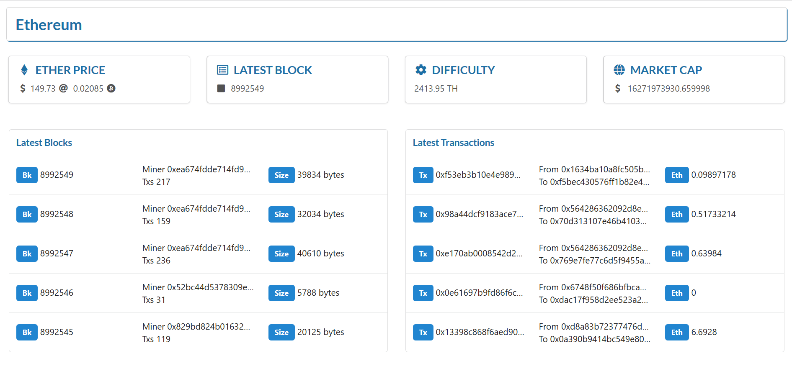

# Etherscan React 

### The complete tutorial is published on [newline](https://www.newline.co/@schadokar/create-your-own-etherscan-with-react-in-5-minutes--4626addd) :tada:

:dog: This project is a simple demonstration of [etherscan](https://etherscan.io) dashboard.

The complete [Tutorial link](https://schadokar.dev/posts/create-your-own-etherscan-with-react-in-5-minutes/).

This project used the [etherscan api](https://etherscan.io/apis) to get the ethereum blockchain data.

For the UI part, instead of basic html and css, we have used the fantastic [semantic-ui](https://react.semantic-ui.com/) library.

This project was bootstrapped with [Create React App](https://github.com/facebook/create-react-app).

## App Setup

1. Create an account in the etherscan and create an api-key token.
2. Clone the repository.
3. Run `npm install` to install all the dependencies.
4. Create an `.env` file in the `src` folder and copy paste the `.env.example` content.
5. Replace the `"ETHERSCAN API KEY"` text with your api key.
6. Run `npm start` to start the application on `localhost:3000`.

## Warning

The free api has a limit of 5 request per sec/ip. When the application was created the request cap was high.

This app is not updated for this limit.

You can create a buffer of 1-2 second in between calls to make it work.

---

This project was bootstrapped with [Create React App](https://github.com/facebook/create-react-app).

# :pencil: Author

### :sun_with_face: Shubham Kumar Chadokar

Hello, I am a Sofware Engineer. :dizzy_face:

I love to write articles and tutorials on latest technologies. :zap:

Check out my other articles and tutorials on my blog.

:link: [schadokar](https://schadokar.in)

## License

MIT License

Copyright (c) 2020 Shubham Chadokar
